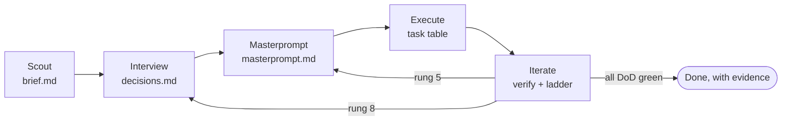

# gentic

A spec-first, test-first, resumable deep workflow for [Claude Code](https://claude.com/claude-code). One command turns a vague request into verified work: informed clarifying questions → a masterprompt that could brief a stranger → execution in small test-first steps → iteration on an escalation ladder with a hard budget.

## Why

We probed a capable agent with a deliberately ambiguous request — *"Add CSV export to the admin dashboard. Should work for the users table and be fast."* — and asked it to narrate its honest default behavior. It reported that it would:

- ask **zero** questions before writing code, silently deciding on its own authority which PII columns to export;
- write **no plan to disk** — "the plan exists in my head" — so a context loss loses everything;
- accept "fast" **by construction, not measurement** — shipping unverified performance claims.

None of that is a capability problem. It is a workflow problem: missing context, missing persistence, missing verification. gentic supplies the workflow.

## The workflow



| Phase | Question it answers | Artifact |
|-------|--------------------|----------|
| **Scout** | What does reality already decide? | `brief.md` — facts, patterns, open decisions each with a recommended default |
| **Interview** | What must the user decide? | `decisions.md` — only high-leverage × high-uncertainty questions get asked (≤4 per round); data/security calls auto-rank first |
| **Masterprompt** | Could a stranger deliver this? | `masterprompt.md` — mission, decisions, non-goals, and a Definition of Done where every item names its exact check **and its test contract**. Then a six-scan critique pass. |
| **Execute** | What's the smallest verified step? | task table in `progress.md` — fibonacci-sized tasks, dependency-ordered riskiest-first, run through [`gentic-tdd`](.claude/skills/gentic-tdd/SKILL.md), one commit per task, each row carrying the failure that was actually observed |
| **Iterate** | Patch, rework, or re-open the spec? | iteration log in `progress.md` — evidence for every DoD item; failures climb a ladder instead of looping |

Every artifact lives in `docs/gentic/<date>-<slug>/` and is committed, so **any session — including one that lost its context — resumes any run** by reading the run directory.

## The test-first spine

Spec-driven and test-driven are one mechanism here, not two practices bolted together.

**The spec designs the tests.** Every Definition of Done item carries a *test contract* — the test
file, the test name, the behaviour asserted, and **the failure to expect**:

```markdown
- [ ] Empty exports are rejected rather than written
      verify: `pytest tests/test_export.py -k empty`
      contract: tests/test_export.py · test_empty_selection_is_rejected ·
                exporting zero rows raises ExportError · expected RED: `Failed: DID NOT RAISE`
```

Predicting the failure is the load-bearing part: it is how the executing agent knows a RED was the
*right* RED and not a typo. An item with a verify command but no contract is checking work nobody
designed — the critique pass now scans for exactly that.

**The tests gate the work.** [`gentic-tdd`](.claude/skills/gentic-tdd/SKILL.md) owns every task —
no production code without a failing test first, and the real failure text is pasted into the task
row:

| # | Task | Size | Test | RED | Status |
|---|------|------|------|-----|--------|
| 1 | Reject empty exports | 2 | `test_empty_selection_is_rejected` | `Failed: DID NOT RAISE` | done |

**A task with an empty `RED` cell is not done.** The cell is the only place a resumed session can
learn the test was ever seen to fail — memory is precisely what a compaction takes away. Docs and
prompts count as behaviour and get contract tests; `n/a` is reserved for tasks that change nothing
observable, and must say why.

**The hooks notice, they do not police.** The ledger now keeps *failing* verification runs — the
RED signal it used to discard — and the Stop hook mentions a turn that changed production code with
no test touched and no failure observed. Advisory, once per session. The verification gate stays
the setup's only hard block, because scarcity is what makes it credible.

## The fibonacci mechanics

- **Task sizes** are 1/2/3/5/8 points; a task above 8 must be split (if it can't be, the spec is under-specified).
- **Escalation rungs** cost 1 (micro-fix), 2 (rework component), 3 (redesign within spec), 5 (re-open masterprompt), 8 (re-open interview). Same item fails twice at a rung → the next rung is mandatory. No third tries.
- **The budget is 13 points per run.** When it's gone, the run stops with an honest handoff instead of thrashing.

The costs grow super-linearly because each rung discards more prior work — and the budget forces a real decision between many small fixes and one deep rethink.

## The agents

Four subagents, each closing a gap the workflow had left to improvisation. All four are plain
markdown in [.claude/agents/](.claude/agents). None of the reviewing three is given an edit
tool. `masterprompt-critic` is fully read-only (`Read, Grep, Glob`); `code-reviewer` and
`dod-auditor` also get `Bash`, which they need to run `git diff` and to execute the checks a
Definition of Done names — so for those two the guarantee is narrower than "cannot": no direct
file-editing tool, plus an instruction not to edit. `.claude/hooks/tests/test_structure.py`
pins each agent's declared tools so this claim and the frontmatter cannot drift apart.

| Agent | Fires when | What makes it useful |
|-------|-----------|----------------------|
| [`code-reviewer`](.claude/agents/code-reviewer.md) | `/review`, `/ship`, or the Stop-hook nudge | Correctness, security, and silent failures — scored 0-100 and **reported only at ≥80**. A reviewer that reports everything gets skimmed and then ignored. |
| [`dod-auditor`](.claude/agents/dod-auditor.md) | the Iterate phase, before any completion claim | Runs each Definition-of-Done check literally and returns PROVEN / FAILED / **UNVERIFIABLE**. It may never edit a DoD item to make it pass, and never rounds unverifiable up to proven. |
| [`masterprompt-critic`](.claude/agents/masterprompt-critic.md) | the Masterprompt critique pass | Gets the spec and nothing else — no brief, no decisions, no conversation. That withheld context is the instrument: it occupies the position of the agent who executes this after a compaction. |
| [`task-executor`](.claude/agents/task-executor.md) | Execute fan-out, on independent 3+ point tasks | Does one task test-first and returns a fixed evidence block. Refuses a vague assignment instead of guessing — it has no channel back to the user, so improvising is how a fan-out produces four readings of one spec. |

Review is no longer something you have to remember. When a session has changed code and no
review has run, the Stop hook prints a one-line suggestion — advisory, never blocking, once per
session. The verification gate stays the setup's only hard block.

## The brain

gentic remembers. One SQLite file, `~/.claude/gentic/brain.sqlite` (set `GENTIC_BRAIN` to put it
elsewhere), holds what earlier runs learned, what the user has decided, and what the hooks saw —
across every project on the machine, keyed by repository name. It is the agent's own memory, and
it may use it as it likes:

```bash
python3 ~/.claude/hooks/lib/brain.py note calendar-dnd "drag and drop needs pointer events on touch"
python3 ~/.claude/hooks/lib/brain.py recall pointer events
python3 ~/.claude/hooks/lib/brain.py preference artifact-location     # exit 1 until learned
python3 ~/.claude/hooks/lib/brain.py lessons
python3 ~/.claude/hooks/lib/brain.py sql "select kind, count(*) from events group by kind"
```

| What it holds | Who writes it | Who reads it |
|---------------|---------------|--------------|
| `events` — every `red` and `verification` run, every gate block and nudge | the hooks, automatically, best-effort | you, via `sql`; later runs' tooling |
| `decisions` and learned preferences | the Interview (`--source user`), the Masterprompt (`--source default`) | the Interview, before it asks |
| `lessons` — what each spent rung taught, and *who caught it* | the Iterate phase | the Scout phase, before it explores |
| `notes` with full-text recall | the agent, whenever something is worth keeping | the Scout phase; anyone |
| `runs` and `stamps` — lifecycle and the sha256 of every skill a run used | the `gentic` skill | future evals, to tie a lesson to a skill version |

The rules are the ones the rest of the setup already lives by. **A brain that is missing, locked
or unwritable is invisible**: the hooks give up within a 34 ms lock timeout and print nothing,
and the harness measures the writing hook against the same 150 ms budget as the others.
**The user's memory is never a test fixture**: `run.sh` and every test point `GENTIC_BRAIN` at a
throwaway file. **A preference is learned, not assumed**: the Interview adopts an answer only
after the user has given it twice, the most recent user answer wins, and defaults never teach.

`sql` is deliberately unrestricted — the agent may create its own tables. Before any `DROP`,
`DELETE`, `UPDATE` or `ALTER` the file is copied to `brain.sqlite.bak`, one level of undo.
Commands recorded as events have credentials scrubbed (`Authorization:`, `--password`,
`token=`, `AWS_…=`); notes are not scrubbed, so never note a secret. There are no schema
migrations: if a later version changes a table, delete the file or point `GENTIC_BRAIN` at a
new one. SQLite's write-ahead log assumes a local disk — a home directory synced by iCloud or
Dropbox is a known hazard; keep the brain out of synced folders.

The [`gentic-brain`](.claude/skills/gentic-brain/SKILL.md) skill carries the full command set
and says where each phase uses it.

## Install

```bash
./install.sh
```

That copies this repo's `.claude/` — skills, agents, hooks, commands — into `~/.claude/`, so
the setup applies to every project, not just this one. It is idempotent, and it only ever
writes the files this repo ships: your own skills, agents, sessions, and plugins are never
touched, and there is no `rm -rf` or `--delete` anywhere in it.

```bash
./install.sh --check
```

Reports any file that has drifted from the repo and exits non-zero, changing nothing.

Hooks and skills take effect immediately. **Agents are resolved when a session starts**, so a
newly installed agent is not invocable in the session that installed it — start a new one.

For gentic alone, without the hooks and agents, copy `.claude/skills/gentic*` into your repo's
skills directory and add the **Routing** section from [CLAUDE.md](CLAUDE.md) to your own — the
workflow is markdown with no dependencies.

Works standalone — the test-first discipline is gentic's own skill, not a borrowed one. If the [superpowers](https://github.com/obra/superpowers) plugin is installed, gentic composes with it (TDD, systematic debugging, verification gates) at marked points.

## Adopting gentic in a project

gentic names its own branches `gentic/<slug>` and its own commits `gentic(<slug>): …` — but
only in projects that asked for it. Everywhere else it follows the conventions already in the
repository, because a workflow that renames your branches is a workflow you uninstall.

A project counts as **adopted** when its root `CLAUDE.md` contains the literal string
`gentic/<slug>` — which it does automatically if you copied the **Routing** and **Conventions**
sections from [CLAUDE.md](CLAUDE.md) as the install instructions describe.

In any other project the branch prefix is read from the branches already there:

| the project's branches | gentic uses |
|---|---|
| `feat/…` ×3, `fix/…` ×2 | `feat/<slug>`, and plain commit subjects |
| `main`, `websockets` | `<slug>`, and plain commit subjects |
| a tie, or a prefix seen once | `<slug>` — inventing a convention is the bug being avoided |

Ask it directly at any time:

```bash
python3 ~/.claude/hooks/lib/project_conventions.py branch my-slug
```

The helper only *prints* a name; it never creates a branch, never writes to a `CLAUDE.md`, and
never fails a run — if anything goes wrong it falls back to the bare slug.

## Verifying the setup

```bash
bash .claude/hooks/tests/run.sh
```

Exit 0 with no `FAIL` lines means the hooks behave, the installer is safe, and the setup is
structurally sound — every agent's frontmatter parses, and every skill, command, agent, and
hook that anything references actually exists. That last check is not hypothetical: this repo
shipped a `/ship` command that invoked three agents from a plugin whose recorded install
directory did not exist. Nothing errored; review just quietly fell back to less than it
claimed. `test_structure.py` exists so that class of defect cannot pass unnoticed again.

## Use

```
/gentic add rate limiting to the public API
```

- New non-trivial task → gentic starts a run and interviews you (up to 4 multiple-choice questions per round, recommendation listed first).
- You're away? Runs don't block: gentic adopts the scouted default for each question, flags it `unconfirmed`, and lists every assumption in the final report.
- `resume` / `continue` → gentic finds the newest unfinished run and re-enters at the first unchecked phase.
- `/gentic status` → every run, its phase, tasks done, budget remaining.

## Example run

This repository built itself with its own workflow — see [docs/gentic/2026-08-11-bootstrap-gentic/](docs/gentic/2026-08-11-bootstrap-gentic/) for a complete run: the brief, the decisions (with alternatives considered), the masterprompt with its Definition of Done, the brief including the baseline probe quoted above, and an iteration log of real fixes from the run's own review gates.

## Design notes

- **Why five phases instead of "questions → masterprompt → iterate"?** The original three-phase shape lacks grounding (questions asked from ignorance are generic) and an anchor for iteration (without a checkable Definition of Done, iteration spins). Scout makes questions sharp; the DoD makes iteration converge.
- **Why not multi-agent-first?** Subagent fan-out is an execution optimization, not a workflow. gentic stays single-threaded by default (cheap, debuggable, no opt-in friction). The four agents are optional accelerants at named points, and each earns its place by being *worse informed* than the main thread in a useful way: `masterprompt-critic` is denied the conversation, `dod-auditor` is denied the author's confidence, `task-executor` is denied the neighbouring tasks. An agent that merely knows what you already know adds cost, not signal.
- **Why a nudge instead of a gate?** The setup has exactly one hard block — a completion claim with no verification behind it. That scarcity is what makes it credible. Everything else, review included, advises and gets out of the way; a second blocker would turn the setup into something to work around.
- **Why files instead of memory?** Context windows end; `docs/gentic/` doesn't. The masterprompt's quality bar — "a stranger could deliver from this file alone" — is also exactly what a post-compaction session needs.

## License

[MIT](LICENSE)
